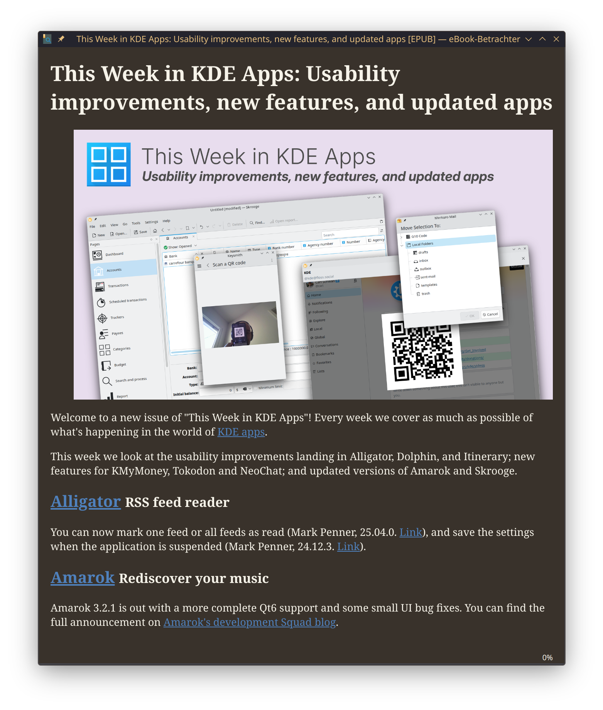

# epub Downloader



Downloads websites as easily readable epub.
Includes images and if yt-dlp is available, **also embedded youtube videos**. A reference to the source is added as second chapter.
It can save epubs with automatic generated YYYY-MM-DD-title.epub filenames and optionally drop them into subfolders by website name.

## Installation

nodejs with npm needs to be installed

```
npm install -g uriesk/epub-downloader
```

## Usage

```
Usage: epub-downloader [-o output_filename] [-p path] [-s] [url-to-article]

-o, --output    Filepath for the epub
-p, --path      Path for the epub, filename will be automatically generated, only effective if -o not given
-s, --create_subfolders Create subfolders by sitename, only effective if -o not given
-m, --download_media    Download embedded youtube videos and include them (yt-dlp needs to be installed and in $PATH)
-f, --media_format      Format string used by yt-dlp, only effective if -m is set
--media_filesize        Maximum file size of the media to download in MiB, only effective if -m is set
-c, --cover     URL to a cover image
```

Use `epub-downloader --help` to see the available options.

### Example

```
epub-downloader https://0pointer.net/blog/linux-boot-partitions.html
```

Will store the article as `2025-01-06_linux-boot-partitions.epub` file into the current directory.

```
epub-downloader -s https://0pointer.net/blog/linux-boot-partitions.html
```

Will store the article under the subfolder `./0pointer.net/2025-01-06_linux-boot-partitions.epub` within the current directory. Directory can be changed with the `-p` option.

